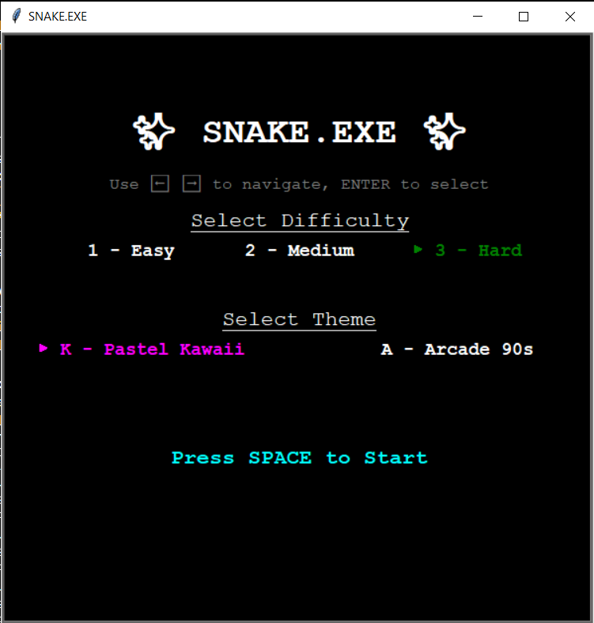
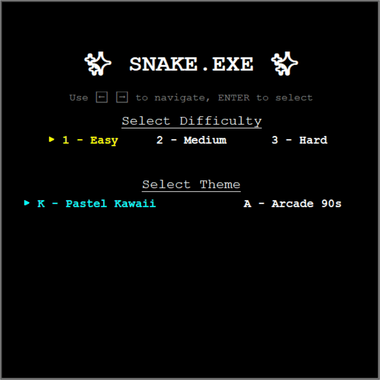

# ✨ SNAKE.EXE ✨

A retro-styled, fully polished Snake game built using Python and the Turtle graphics module — enhanced with sound effects, theme customization, animated menus, difficulty selection, special modes, and persistent high score tracking.

## 🖼 Demo

  


## 🎮 Features

- **Animated Start Menu**  
  Navigate using arrow keys and confirm selections with ENTER — choose from:
  - Difficulty: Easy, Medium, Hard
  - Theme: Pastel Kawaii 🌸 or Arcade 90s 🎮

- **Sound Effects + Music**  
  - Menu and game themes with looping background music  
  - Distinct sounds for selection, special mode, food, game over, and high score!

- **Smooth Gameplay Mechanics**
  - Classic snake behavior: movement, growth, wall and tail collision
  - Gradual speed increase for added challenge
  - Polished game loop and controls (arrow keys to move)

- **Special Mode Power-Up**  
  Every 5 points, a flashing gold food appears. If eaten quickly:
  - Snake glows gold ✨
  - Double points for 10 seconds
  - Special mode countdown shown on screen

- **High Score System**
  - Tracks and saves your highest score in a text file  
  - Celebrates with a flashing "NEW HIGH SCORE!" animation and sound

- **Replay Menu with Arrow Navigation**
  - After Game Over, use ⬅️ ➡️ to select:
    - **Replay**
    - **Quit**

## 🐍 Technologies Used

- Python 3
- Turtle graphics module (GUI + drawing)
- `playsound` for sound effects
- `pygame.mixer` for looping background music
- Object-Oriented Programming (OOP) design with custom classes

## 🧠 What I Learned

This project was a deep dive into:
- Real-time game logic and loop-based updates
- OOP best practices and modular design across multiple files
- Event-driven programming with `turtle`-style key binding
- Audio integration in Python using both `playsound` and `pygame.mixer`
- Designing intuitive menus and gameplay flows within Turtle's limitations
- File handling for persistent score tracking
- UX polishing with visual and audio feedback systems

## 📂 Project Structure

```
snake_game/
├── main.py
├── snake.py
├── food.py
├── scoreboard.py
├── screenshot.png
├── demo.gif
├── sounds/
│   ├── menu_theme.mp3
│   ├── game_theme.wav
│   ├── select.wav
│   ├── food.wav
│   ├── special_mode.mp3
│   ├── game_over.wav
│   └── new_high_score.wav
├── high_score.txt  ← (auto-generated during gameplay)
├── .gitignore
└── README.md
```

## 🚀 How to Run

1. Clone this repo:
   ```bash
   git clone https://github.com/yourusername/snake_game.git
   ```

2. Install dependencies:
   ```bash
   pip install playsound pygame
   ```

3. Run the game:
   ```bash
   python main.py
   ```

---

## 🔮 Future Improvements

- Add obstacles and evolving level layouts for progressive difficulty
- Create animated snake skins or sprite styles for visual variety
- Implement particle effects or glow trails during special mode
- Build a simple high score leaderboard to support multiple players
- Package the game as a standalone executable for easier sharing

---

## 🛑 Notes

- `high_score.txt` is auto-generated at runtime to store your best score. It is excluded from version control via `.gitignore`.
- This game is completely self-contained and requires **no deployment** or external services.